# Ammonia Sensor Module

## Purpose
The ammonia sensor module measures dissolved ammonia (NH₃) and ammonium (NH₄⁺) concentrations in water. This is critical for aquatic ecosystem health as ammonia is:
- **Highly toxic** to fish and aquatic life even in low concentrations
- **Primary indicator** of biological waste and decomposition
- **Key parameter** for water quality assessment in aquaculture
- **Early warning** for system overload or equipment failure

## Components Table

| Component | Specification | Purpose |
|-----------|---------------|---------|
| ESP32 | 38-pin development board | Main microcontroller for data processing |
| Ion Selective Electrode | NH₄⁺ ISE with reference electrode | Measures ammonium ion concentration |
| Atlas Scientific ISE Circuit | EZO-PH circuit modified for ISE | Signal conditioning and amplification |
| DS18B20 | Waterproof temperature sensor | Temperature compensation for ISE readings |
| pH Sensor | For NH₃/NH₄⁺ ratio calculation | Determines ammonia species distribution |
| Operational Amplifier | High impedance buffer (>10¹² Ω) | Prevents electrode loading |
| Waterproof Enclosure | IP68 rated | Protects electronics from water |
| Calibration Solutions | 1, 10, 100 mg/L NH₄⁺ standards | For sensor calibration |

## Workflow Diagram

```mermaid
graph LR
    A[Power On] --> B[Initialize Sensors]
    B --> C[Calibrate ISE]
    C --> D[Read Temperature]
    D --> E[Read pH]
    E --> F[Read ISE Voltage]
    F --> G[Apply Nernst Equation]
    G --> H[Calculate NH₄⁺ Concentration]
    H --> I[Calculate NH₃ from pH]
    I --> J[Apply Temperature Compensation]
    J --> K[Validate Reading]
    K --> L[Transmit Data via MQTT]
    L --> M[Deep Sleep Mode]
    M --> N[Wake Up Timer]
    N --> D
    
    style A fill:#f9f,stroke:#333,stroke-width:2px
    style L fill:#9f9,stroke:#333,stroke-width:2px
    style M fill:#99f,stroke:#333,stroke-width:2px
```



## Calibration Steps

### Required Materials
- 1 mg/L NH₄⁺-N standard solution
- 10 mg/L NH₄⁺-N standard solution
- 100 mg/L NH₄⁺-N standard solution
- pH adjustment solutions (NaOH, HCl)
- Ionic strength adjustment solution (KCl)
- Distilled water for rinsing
- Magnetic stirrer and stir bars

### Procedure

1. **Electrode Conditioning**
   - Soak electrodes in 10 mg/L NH₄⁺ solution for 2 hours
   - Rinse with distilled water
   - Allow to stabilize for 30 minutes

2. **Ionic Strength Adjustment**
   - Add ISA (Ionic Strength Adjuster) to all solutions
   - Maintain constant ionic strength across calibration range
   - Use 2 mL ISA per 100 mL sample

3. **Multi-Point Calibration**
   - Start with lowest concentration (1 mg/L)
   - Immerse electrodes ensuring no air bubbles
   - Stir gently to maintain solution homogeneity
   - Wait for stable reading (±1 mV for 60 seconds)
   - Record voltage reading
   - Repeat for 10 mg/L and 100 mg/L standards
   - Calculate slope and intercept

4. **Slope Validation**
   - Theoretical slope: 59.16 mV/decade at 25°C
   - Acceptable range: 50-65 mV/decade
   - If outside range, replace electrode or re-condition

5. **Verification**
   - Test with independent standard (different lot)
   - Check against certified reference material
   - Acceptable error: ±10% of true value

### Calibration Frequency
- **Initial**: Before first use
- **Regular**: Every week
- **After maintenance**: Electrode replacement or cleaning
- **Quality control**: Monthly with certified standards

## Maintenance Schedule

### Daily
- Visual inspection for electrode damage
- Check data transmission and connectivity
- Verify readings are within expected range
- Monitor for electrical interference

### Weekly
- Clean electrodes with deionized water
- Check reference electrode filling solution
- Verify temperature compensation accuracy
- Perform single-point calibration check

### Monthly
- Full multi-point calibration
- Replace reference electrode filling solution
- Clean electrode surfaces with appropriate solutions
- Check all electrical connections and cables
- Update firmware if available

### Quarterly
- Replace electrodes if slope is poor
- Comprehensive system diagnostic
- Clean and inspect enclosure seals
- Verify power supply stability
- Performance audit against independent method

### Annually
- Replace ion-selective electrodes
- Replace reference electrodes
- Update calibration procedures
- Comprehensive training refresher
- Documentation review and archival

## Troubleshooting

### Common Issues and Solutions

| Problem | Symptoms | Possible Cause | Solution |
|---------|----------|----------------|----------|
| Poor Slope | Slope <50 mV/decade | Aged electrode membrane | Replace ISE electrode |
| Drift | Readings change over time | Reference electrode issues | Replace reference electrode |
| Slow Response | >5 minutes to stabilize | Electrode poisoning | Clean and recondition electrode |
| Interference | Erratic readings | Other ions present | Use more selective electrode |
| No Response | Constant reading | Broken electrode | Check continuity, replace if needed |
| Temperature Error | Inconsistent compensation | Faulty temperature sensor | Replace DS18B20 sensor |

### Electrode Maintenance
- **Daily**: Rinse with deionized water
- **Weekly**: Soak in conditioning solution
- **Monthly**: Clean with appropriate cleaning solution
- **Storage**: Store in conditioning solution, not water
- **Handling**: Avoid touching membrane surface

### Common Interferences
- **Potassium**: Can cause positive interference
- **Organic amines**: May respond to ISE
- **High pH**: Affects NH₃/NH₄⁺ equilibrium
- **High ionic strength**: Affects activity coefficients
- **Temperature**: Affects electrode response and equilibrium

## Data Interpretation

### Normal Ranges
- **Freshwater**: <0.5 mg/L NH₃-N (non-toxic)
- **Marine**: <0.1 mg/L NH₃-N (sensitive species)
- **Aquaculture**: <0.02 mg/L NH₃-N (intensive systems)
- **Drinking Water**: <0.5 mg/L NH₃-N (EPA standard)

### Toxic Thresholds
- **Acute**: >2.0 mg/L NH₃-N (fish kill likely)
- **Chronic**: >0.5 mg/L NH₃-N (long-term health effects)
- **Sensitive Species**: >0.1 mg/L NH₃-N (reproduction effects)

### pH and Temperature Effects
- **pH < 7**: Mostly NH₄⁺ (less toxic)
- **pH > 9**: Mostly NH₃ (highly toxic)
- **Temperature**: Higher T increases NH₃ fraction
- **Calculation**: pKa = 9.25 at 25°C

### Temporal Patterns
- **Diurnal**: Higher at night (respiration)
- **Seasonal**: Higher in summer (decomposition)
- **Weather**: Rain can wash in organic matter
- **Feeding**: Spikes after feeding events

## NH₃/NH₄⁺ Equilibrium Calculations

### Henderson-Hasselbalch Equation
```
pH = pKa + log([NH₃]/[NH₄⁺])
```

### Temperature-Dependent pKa
```
pKa = 9.25 + (0.0324 × (T - 25))
```
where T is temperature in °C

### Fraction Calculations
```
fNH₃ = 1 / (1 + 10^(pKa - pH))
fNH₄⁺ = 1 - fNH₃
```

### Toxic Ammonia Concentration
```
NH₃ = Total_Ammonia × fNH₃
```

## Quality Assurance

### Calibration Validation
- **Slope check**: 50-65 mV/decade acceptable
- **Correlation**: R² > 0.995 for calibration curve
- **Precision**: <5% RSD for duplicate measurements
- **Accuracy**: ±10% of certified reference value

### Data Validation
- **Range checking**: 0.01-100 mg/L typical range
- **Rate of change**: <50% change per hour (unless feeding)
- **Temperature correlation**: Verify with independent sensor
- **pH correlation**: Check NH₃/NH₄⁺ equilibrium

### Interference Testing
- **Potassium**: Test with varying K⁺ concentrations
- **Organic compounds**: Test with known interferents
- **Matrix effects**: Compare with standard additions
- **Cross-sensitivity**: Test with other cations

## Safety Considerations

### Chemical Handling
- **Ammonia solutions**: Use in well-ventilated area
- **Concentrated standards**: Wear appropriate PPE
- **Disposal**: Follow local environmental regulations
- **Storage**: Keep standards refrigerated and sealed

### Electrical Safety
- **High impedance**: Use proper grounding
- **Isolation**: Galvanic isolation recommended
- **Cables**: Use low-noise, shielded cables
- **Connections**: Maintain clean, dry connections

### Environmental Impact
- **Electrode disposal**: Follow hazardous waste procedures
- **Solution disposal**: Neutralize before disposal
- **Calibration standards**: Minimize environmental release
- **Cleaning solutions**: Use biodegradable cleaners when possible

## Integration with Other Sensors

### pH Sensor Coupling
- **Essential**: Required for NH₃/NH₄⁺ calculation
- **Location**: Within 10 cm of ammonia sensor
- **Timing**: Simultaneous measurements required
- **Calibration**: Both sensors must be calibrated

### Temperature Compensation
- **Coefficient**: 2-3% per °C for ISE response
- **Equilibrium**: 0.032 pH units per °C for pKa
- **Real-time**: Continuous temperature monitoring
- **Validation**: Check against independent thermometer

### Dissolved Oxygen Correlation
- **Decomposition**: Low DO often correlates with high NH₃
- **Nitrification**: High DO promotes NH₃ oxidation
- **Validation**: Use for data quality checks
- **Alerts**: Set up correlated alarm systems

## Advanced Features

### Multi-Species Calculation
- **Total Ammonia**: Sum of NH₃ and NH₄⁺
- **Toxic Ammonia**: NH₃ concentration only
- **Ionization Factor**: pH and temperature dependent
- **Species Distribution**: Real-time calculation

### Predictive Analytics
- **Trend Analysis**: Identify increasing patterns
- **Feeding Response**: Correlate with feeding events
- **Seasonal Patterns**: Long-term trend identification
- **Early Warning**: Predict toxic conditions

### Data Fusion
- **Multiple Sensors**: Average multiple ISE readings
- **Cross-Validation**: Compare with colorimetric methods
- **Uncertainty Analysis**: Propagate measurement errors
- **Quality Flags**: Automated data quality assessment
