# Fish Feeding Monitor

## Purpose
The Fish Feeding Monitor uses computer vision to detect and analyze fish feeding behavior, measuring strike rates and feeding efficiency. This system provides critical insights into:
- **Fish health** - Active feeding indicates healthy fish
- **Feed optimization** - Prevents overfeeding and waste
- **Behavioral patterns** - Identifies feeding preferences and timing
- **Early disease detection** - Reduced feeding often indicates health issues
- **Environmental stress** - Feeding behavior reflects water quality conditions

## Components Table

| Component | Specification | Purpose |
|-----------|---------------|---------|
| Raspberry Pi 4 | 8GB RAM, 64GB microSD | Main processing unit for computer vision |
| Camera Module | Pi Camera V2.1, 8MP | Captures feeding behavior video |
| Infrared LEDs | 850nm, 5W array | Provides illumination for night feeding |
| Underwater Housing | IP68 rated, optical window | Protects camera from water |
| Wide-angle Lens | 160° field of view | Captures larger feeding area |
| Servo Motor | MG996R, 180° rotation | Controls feeding mechanism |
| Feed Dispenser | Automatic fish feeder | Dispenses measured food portions |
| Motion Sensor | PIR sensor | Detects fish activity |
| Power Supply | 12V/5A switching supply | Powers all components |
| Cooling Fan | 40mm, 12V | Prevents overheating in housing |

## Workflow Diagram

```mermaid
graph LR
    A[Power On] --> B[Initialize Camera]
    B --> C[Load AI Models]
    C --> D[Calibrate Background]
    D --> E[Monitor Fish Activity]
    E --> F[Detect Feeding Event]
    F --> G[Trigger Food Dispenser]
    G --> H[Record Feeding Video]
    H --> I[Analyze Strike Rate]
    I --> J[Count Fish Responses]
    J --> K[Calculate Feed Efficiency]
    K --> L[Transmit Data via MQTT]
    L --> M[Sleep Until Next Feeding]
    M --> E
    
    style A fill:#f9f,stroke:#333,stroke-width:2px
    style G fill:#ff9,stroke:#333,stroke-width:2px
    style L fill:#9f9,stroke:#333,stroke-width:2px
```

## Calibration Steps

### Camera Calibration
1. **Position Setup**
   - Mount camera 0.5-1.0m above water surface
   - Ensure 45° angle for optimal viewing
   - Verify entire feeding area is visible
   - Check for reflections and glare

2. **Focus Adjustment**
   - Use test pattern for initial focus
   - Adjust lens for maximum sharpness
   - Account for water refraction
   - Test at different water levels

3. **Exposure Settings**
   - Set manual exposure for consistency
   - Adjust for underwater lighting conditions
   - Test with and without IR illumination
   - Optimize for fish contrast

4. **Color Calibration**
   - Use color reference card
   - Adjust white balance for underwater conditions
   - Test with different feed colors
   - Validate color detection algorithms

### Food Detection Calibration
1. **Feed Type Characterization**
   - Photograph feed pellets in various conditions
   - Measure size distribution (diameter, length)
   - Analyze color spectrum in water
   - Document settling velocity

2. **Background Modeling**
   - Capture empty tank/pond images
   - Create statistical background model
   - Account for lighting variations
   - Model water surface movement

3. **Detection Thresholds**
   - Test with known feed quantities
   - Adjust sensitivity for feed size
   - Minimize false positives from debris
   - Validate with manual counts

### Strike Rate Calibration
1. **Fish Behavior Modeling**
   - Record normal swimming patterns
   - Identify feeding approach behaviors
   - Characterize strike movements
   - Document species-specific behaviors

2. **Motion Detection**
   - Set motion sensitivity thresholds
   - Filter out non-feeding movements
   - Optimize for different fish sizes
   - Account for water turbulence

3. **Temporal Analysis**
   - Define strike event duration
   - Set minimum inter-strike intervals
   - Characterize feeding frenzy periods
   - Model satiation effects

## Maintenance Schedule

### Daily
- Check camera lens for fouling or condensation
- Verify video recording functionality
- Review feeding event logs
- Clean IR LED array if needed

### Weekly
- Download and backup video data
- Clean camera housing exterior
- Check servo motor operation
- Verify feed dispenser mechanism

### Monthly
- Deep clean camera housing
- Inspect seals and gaskets
- Calibrate feeding mechanism
- Update AI models if needed
- Analyze feeding pattern trends

### Quarterly
- Replace dessicant in housing
- Service feed dispenser mechanism
- Comprehensive system testing
- Update software and firmware
- Performance validation with manual counts

### Annually
- Replace camera module if degraded
- Overhaul feeding mechanism
- Replace IR LEDs if dimmed
- Complete system recalibration
- Review and update algorithms

## Troubleshooting

### Camera Issues
| Problem | Symptoms | Possible Cause | Solution |
|---------|----------|----------------|----------|
| Blurry Images | Soft focus, poor detail | Lens fouling, condensation | Clean lens, check dessicant |
| Dark Images | Underexposed video | IR LED failure, power issue | Check LEDs, verify power |
| No Image | Black screen | Camera failure, cable issue | Check connections, replace camera |
| Flickering | Intermittent image | Loose connection | Secure all connections |

### Detection Issues
| Problem | Symptoms | Possible Cause | Solution |
|---------|----------|----------------|----------|
| False Positives | Non-feed objects detected | Debris, air bubbles | Adjust detection parameters |
| Missed Strikes | Low strike count | Sensitivity too low | Increase motion sensitivity |
| Erratic Counts | Inconsistent results | Lighting changes | Improve lighting consistency |
| No Detection | Zero counts | Algorithm failure | Restart system, check calibration |

### Feeding System Issues
| Problem | Symptoms | Possible Cause | Solution |
|---------|----------|----------------|----------|
| No Dispensing | Feed not released | Servo failure, blockage | Check servo, clear blockage |
| Incorrect Amount | Wrong feed quantity | Calibration error | Recalibrate dispenser |
| Timing Issues | Delayed response | Software lag | Optimize processing pipeline |
| Jamming | Feed dispenser stuck | Moisture, clumping | Clean and dry mechanism |

## Data Interpretation

### Strike Rate Metrics
- **Strike Rate**: Number of feeding strikes per minute
- **Response Time**: Time from food appearance to first strike
- **Feeding Duration**: Total time of active feeding
- **Participation Rate**: Percentage of fish that feed

### Normal Ranges
- **Healthy Fish**: 5-15 strikes per minute during feeding
- **Response Time**: <10 seconds for hungry fish
- **Feeding Duration**: 2-5 minutes for complete meal
- **Participation**: >80% of fish should participate

### Alert Thresholds
- **Low Activity**: <3 strikes per minute
- **Delayed Response**: >30 seconds to first strike
- **Short Duration**: <1 minute feeding time
- **Low Participation**: <50% of fish feeding

### Behavioral Patterns
- **Feeding Frenzy**: Initial high strike rate (>20/min)
- **Satiation**: Gradual decline in strike rate
- **Competition**: Multiple fish per food item
- **Selectivity**: Preference for certain food sizes

## Environmental Factors

### Water Quality Impact
- **pH**: Affects feeding behavior (optimal 7.0-8.5)
- **Temperature**: Influences metabolism and appetite
- **Dissolved Oxygen**: Low DO reduces feeding activity
- **Ammonia**: Elevated levels suppress appetite

### Lighting Conditions
- **Natural Light**: Varies throughout day
- **Artificial Light**: Consistent but may affect behavior
- **IR Illumination**: Invisible to fish, enables night monitoring
- **Shadows**: Can interfere with detection

### Weather Effects
- **Rain**: Reduces water clarity, affects vision
- **Wind**: Creates water surface turbulence
- **Pressure**: Barometric changes affect fish behavior
- **Seasons**: Feeding patterns change with temperature

## AI Model Training

### Data Collection
- **Feeding Videos**: 100+ hours of various conditions
- **Annotation**: Manual labeling of fish strikes
- **Species Diversity**: Multiple fish species and sizes
- **Environmental Conditions**: Various lighting and water conditions

### Model Architecture
- **Object Detection**: YOLO v5 for fish and food detection
- **Motion Analysis**: Optical flow for movement tracking
- **Behavior Classification**: CNN for strike identification
- **Temporal Analysis**: LSTM for feeding pattern recognition

### Training Process
1. **Data Preprocessing**: Normalize lighting, resize images
2. **Augmentation**: Rotate, flip, adjust brightness
3. **Model Training**: 1000+ epochs with validation
4. **Hyperparameter Tuning**: Optimize detection thresholds
5. **Validation**: Test on unseen data

### Performance Metrics
- **Detection Accuracy**: >95% for fish identification
- **Strike Recognition**: >90% accuracy for feeding events
- **False Positive Rate**: <5% for food detection
- **Processing Speed**: Real-time analysis (>30 FPS)

## Integration Features

### MQTT Communication
- **Data Publishing**: Real-time feeding metrics
- **Alert System**: Immediate notifications for anomalies
- **Remote Control**: Trigger feeding sessions remotely
- **Status Updates**: System health and performance

### Database Integration
- **Time Series**: Store feeding data over time
- **Trend Analysis**: Identify long-term patterns
- **Correlation**: Link feeding to environmental data
- **Reporting**: Generate feeding behavior reports

### Mobile App Integration
- **Live Video**: Real-time feeding monitoring
- **Notifications**: Alerts for feeding anomalies
- **Manual Control**: Trigger feeding sessions
- **Data Visualization**: Charts and graphs of feeding patterns

## Advanced Analytics

### Feeding Efficiency
- **Conversion Rate**: Food consumed vs. offered
- **Waste Reduction**: Minimize uneaten food
- **Optimal Timing**: Identify best feeding times
- **Portion Control**: Adjust feed amounts based on response

### Health Monitoring
- **Appetite Trends**: Long-term feeding pattern analysis
- **Early Warning**: Detect health issues before visible symptoms
- **Growth Correlation**: Link feeding behavior to growth rates
- **Stress Indicators**: Identify environmental stressors

### Economic Optimization
- **Feed Cost**: Minimize waste and optimize nutrition
- **Labor Savings**: Automated feeding reduces manual work
- **Production Efficiency**: Maximize fish growth and health
- **ROI Analysis**: Calculate return on investment

## Safety Considerations

### Electrical Safety
- **Waterproof Connections**: IP68 rated for all underwater components
- **GFCI Protection**: Ground fault circuit interrupter for safety
- **Low Voltage**: 12V system for reduced shock risk
- **Isolation**: Galvanic isolation for underwater components

### Fish Welfare
- **Non-invasive**: No physical contact with fish
- **Behavior Neutral**: Minimal impact on natural behavior
- **Stress Monitoring**: Detect signs of system-induced stress
- **Emergency Stop**: Manual override for feeding system

### Environmental Impact
- **Biodegradable**: Use eco-friendly materials where possible
- **Energy Efficient**: Optimize power consumption
- **Waste Minimization**: Reduce overfeeding and waste
- **Species Protection**: Avoid harm to non-target species

## Future Enhancements

### Machine Learning Improvements
- **Deep Learning**: Advanced neural networks for better accuracy
- **Transfer Learning**: Apply models across different species
- **Continuous Learning**: Update models with new data
- **Federated Learning**: Share insights across multiple systems

### Hardware Upgrades
- **Higher Resolution**: 4K cameras for better detail
- **Thermal Imaging**: Detect fish body temperature
- **Underwater Drones**: Mobile monitoring platforms
- **IoT Sensors**: Additional environmental monitoring

### Software Features
- **Predictive Analytics**: Forecast feeding requirements
- **Automated Optimization**: Self-adjusting feeding schedules
- **Multi-site Management**: Centralized control of multiple systems
- **API Integration**: Connect with existing aquaculture management systems
