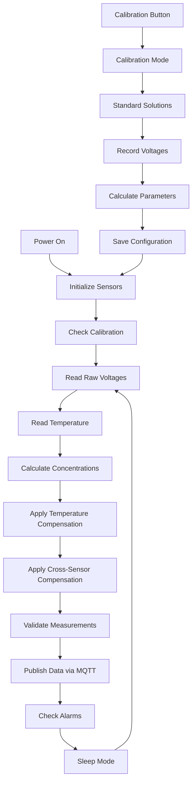

# Nitrite/Nitrate Sensor Module

## Overview
This module monitors nitrite (NO₂⁻) and nitrate (NO₃⁻) levels in aquatic environments using ion-selective electrodes (ISE). These nitrogen compounds are critical indicators of water quality and biological processes in aquatic systems.

## Purpose
- Monitor nitrogen cycle progression
- Detect toxic nitrite levels
- Track nitrate accumulation
- Provide early warning of water quality issues
- Support aquaculture management decisions

## Components Required
- ESP32 microcontroller
- Nitrite ion-selective electrode
- Nitrate ion-selective electrode
- Reference electrode (Ag/AgCl)
- Temperature sensor (DS18B20)
- Signal conditioning circuit
- pH meter (for compensation)
- Conductivity meter (for compensation)
- Calibration solutions
- Waterproof enclosure

## System Workflow

## Installation
1. **Hardware Setup**
   - Connect ESP32 to power supply
   - Connect ISE electrodes to analog inputs
   - Connect temperature sensor to digital pin
   - Install in waterproof enclosure

2. **Software Setup**
   - Upload firmware using Arduino IDE or PlatformIO
   - Configure WiFi credentials
   - Set MQTT broker details
   - Configure measurement intervals

3. **Initial Setup**
   - Perform sensor calibration
   - Test communication
   - Verify measurement accuracy

## Calibration Steps
1. **Preparation**
   - Prepare standard solutions (0.1, 1.0, 10.0 mg/L NO₂⁻)
   - Prepare standard solutions (1.0, 10.0, 100.0 mg/L NO₃⁻)
   - Ensure electrodes are clean and conditioned

2. **Calibration Process**
   - Press calibration button to enter calibration mode
   - Follow prompts for each standard solution
   - Wait for voltage stabilization
   - Record voltages for each standard
   - System automatically calculates calibration parameters

3. **Verification**
   - Test with known standard
   - Verify accuracy within ±5%
   - Save calibration data

## Maintenance
- **Daily**: Check sensor readings and alarms
- **Weekly**: Clean electrodes, verify calibration
- **Monthly**: Replace reference electrode filling solution
- **Quarterly**: Full recalibration with fresh standards
- **Annually**: Replace electrodes if necessary

## Data Interpretation
- **Nitrite (NO₂⁻)**:
  - Normal: < 0.5 mg/L
  - Elevated: 0.5-3.0 mg/L
  - Critical: > 3.0 mg/L
- **Nitrate (NO₃⁻)**:
  - Normal: < 50 mg/L
  - Elevated: 50-200 mg/L
  - Critical: > 200 mg/L

## Troubleshooting
- **Erratic readings**: Check electrode connections, clean electrodes
- **Calibration drift**: Replace reference electrode, recalibrate
- **No response**: Check power supply, verify wiring
- **High noise**: Shield cables, check grounding

## Quality Assurance
- Automatic quality scoring based on measurement stability
- Cross-validation with other sensors
- Drift detection and compensation
- Data validation and filtering

## Safety Considerations
- Handle standard solutions with care
- Dispose of chemicals properly
- Ensure waterproof connections
- Follow electrical safety guidelines

## Integration
- Compatible with unified MQTT data format
- Supports OTA firmware updates
- Integrates with power management system
- Cross-compensates with pH and conductivity sensors
