# pH Sensor Module

## Purpose
The pH sensor module measures the hydrogen ion concentration in water, providing critical information about water acidity/alkalinity. pH is fundamental to aquatic ecosystem health as it affects:
- **Fish physiology** - Most fish thrive in pH 6.5-8.5
- **Nutrient availability** - Affects plant and algae growth
- **Chemical processes** - Influences metal solubility and toxicity
- **Biological activity** - Affects microbial processes and oxygen levels

## Components Table

| Component | Specification | Purpose |
|-----------|---------------|---------|
| ESP32 | 38-pin development board | Main microcontroller for data processing |
| Atlas Scientific pH Circuit | EZO-pH | Signal conditioning and temperature compensation |
| pH Electrode | Laboratory grade with BNC connector | Measures hydrogen ion activity |
| DS18B20 | Waterproof temperature sensor | Temperature compensation for pH readings |
| Voltage Divider | 10kΩ resistors | Scale voltage for ESP32 ADC |
| Waterproof Enclosure | IP67 rated | Protects electronics from water |
| BNC Connector | Female, panel mount | Connects pH electrode to circuit |
| Power Supply | 5V/3.3V converter | Powers sensors and ESP32 |

## Workflow Diagram

```mermaid
graph LR
    A[Power On] --> B[Initialize Sensors]
    B --> C[Calibrate pH Probe]
    C --> D[Read Temperature]
    D --> E[Read pH Voltage]
    E --> F[Apply Temperature Compensation]
    F --> G[Convert to pH Units]
    G --> H[Validate Reading]
    H --> I[Transmit Data via MQTT]
    I --> J[Deep Sleep Mode]
    J --> K[Wake Up Timer]
    K --> D
    
    style A fill:#f9f,stroke:#333,stroke-width:2px
    style I fill:#9f9,stroke:#333,stroke-width:2px
    style J fill:#99f,stroke:#333,stroke-width:2px
```



## Calibration Steps

### Required Materials
- pH 4.01 buffer solution (red)
- pH 7.00 buffer solution (yellow)
- pH 10.01 buffer solution (blue)
- Distilled water for rinsing
- Soft tissue for drying
- Calibration beakers (3)

### Procedure
1. **Preparation**
   - Rinse electrode with distilled water
   - Gently pat dry with soft tissue
   - Allow sensor to reach ambient temperature (15-30 minutes)

2. **Two-Point Calibration**
   - Immerse electrode in pH 7.00 buffer
   - Wait for stable reading (±0.01 pH units for 30 seconds)
   - Press calibration button or send calibration command
   - Record "mid" calibration point
   - Rinse electrode thoroughly with distilled water
   - Immerse in pH 4.01 buffer
   - Wait for stable reading
   - Press calibration button or send calibration command
   - Record "low" calibration point

3. **Three-Point Calibration (Recommended)**
   - Perform two-point calibration first
   - Rinse electrode thoroughly
   - Immerse in pH 10.01 buffer
   - Wait for stable reading
   - Press calibration button or send calibration command
   - Record "high" calibration point

4. **Verification**
   - Test with pH 7.00 buffer again
   - Reading should be 7.00 ± 0.05 pH units
   - If not within range, repeat calibration
   - Store calibration constants to EEPROM

### Calibration Frequency
- **Initial**: Before first use
- **Regular**: Every 2 weeks
- **After maintenance**: Electrode replacement or cleaning
- **Environmental**: Significant temperature changes

## Maintenance Schedule

### Daily
- Visual inspection for damage or fouling
- Check data transmission
- Verify readings are within expected range

### Weekly
- Clean electrode with deionized water
- Check reference junction for blockages
- Verify temperature compensation is working

### Monthly
- Full calibration with three buffer solutions
- Clean electrode with appropriate cleaning solution
- Check all electrical connections
- Update firmware if needed

### Quarterly
- Replace electrode if slope is <50 mV/pH
- Clean and inspect enclosure seals
- Check power supply voltage levels
- Perform system diagnostic tests

### Annually
- Replace pH electrode (typical lifespan 12-18 months)
- Replace temperature sensor if accuracy degrades
- Update calibration procedures
- Comprehensive system audit

## Troubleshooting

### Common Issues and Solutions

| Problem | Symptoms | Possible Cause | Solution |
|---------|----------|----------------|----------|
| Slow Response | Takes >2 minutes to stabilize | Dirty electrode | Clean with 0.1M HCl, then pH buffer |
| Erratic Readings | Unstable, jumping values | Cracked electrode bulb | Replace electrode |
| Poor Slope | Calibration slope <50 mV/pH | Aged electrode | Replace electrode |
| Offset Drift | Consistent bias in readings | Reference junction issues | Clean junction, replace KCl |
| No Response | No change in different solutions | Broken electrode | Check continuity, replace if needed |
| Temperature Error | Incorrect compensation | Bad temp sensor | Replace DS18B20 sensor |

### Diagnostic Commands
```
pH,Cal,clear    // Clear calibration
pH,Cal,mid,7.00 // Calibrate mid point
pH,Cal,low,4.00 // Calibrate low point  
pH,Cal,high,10.00 // Calibrate high point
pH,Cal,?        // Query calibration status
pH,Slope,?      // Query electrode slope
pH,T,25.0       // Set temperature
pH,R            // Take reading
```

### Expected Performance
- **Range**: 0.001 - 14.000 pH
- **Resolution**: 0.001 pH
- **Accuracy**: ±0.02 pH
- **Response Time**: <1 second (90% of reading)
- **Temperature Range**: -5°C to 100°C
- **Pressure Rating**: 690 kPa (100 psi)

## Installation Guidelines

### Electrode Placement
- **Depth**: 0.5-1.0 meters below surface
- **Location**: Away from inlet/outlet streams
- **Orientation**: Electrode tip pointing downward
- **Protection**: Install in protective cage if needed

### Electrical Connections
- Use shielded cable for electrode connection
- Keep cable length <10 meters to minimize noise
- Ensure proper grounding of system
- Use marine-grade connectors for outdoor installation

### Environmental Considerations
- **Temperature**: Install temperature sensor within 10cm of pH electrode
- **Flow**: Gentle water movement improves response time
- **Biofouling**: Consider copper tape or UV sterilization
- **Calibration**: In-situ calibration preferred over removal

## Data Interpretation

### Normal Ranges
- **Freshwater**: pH 6.5 - 8.5
- **Marine**: pH 7.8 - 8.3
- **Drinking Water**: pH 6.5 - 8.5
- **Aquaculture**: pH 7.0 - 8.0

### Alert Thresholds
- **Critical Low**: pH < 6.0
- **Warning Low**: pH < 6.5
- **Warning High**: pH > 8.5
- **Critical High**: pH > 9.0

### Temporal Patterns
- **Diurnal**: pH typically rises during day (photosynthesis)
- **Seasonal**: Lower pH in winter, higher in summer
- **Weather**: Rain events can lower pH
- **Biological**: Algae blooms increase pH during day

## Integration with Other Sensors

### Temperature Compensation
- Automatic compensation using DS18B20 sensor
- Coefficient: -0.0003 pH/°C (typical)
- Real-time adjustment of readings

### Dissolved Oxygen Correlation
- High pH often correlates with high DO (photosynthesis)
- Low pH may indicate decomposition processes
- Use for data validation and quality control

### Conductivity Relationships
- pH affects ionic strength and conductivity
- Useful for identifying measurement errors
- Helps distinguish between different water types

## Quality Assurance

### Data Validation
- Range checking (0-14 pH)
- Rate of change limits (±0.5 pH/hour)
- Temperature compensation verification
- Comparison with nearby sensors

### Calibration Verification
- Monthly check with independent pH meter
- Duplicate measurements on splits samples
- Proficiency testing with certified samples
- Documentation of all calibration activities

### Maintenance Records
- Calibration dates and results
- Electrode replacement history
- Cleaning and maintenance activities
- Performance trends and degradation

## Safety Considerations

### Chemical Handling
- pH buffer solutions are generally safe
- Cleaning solutions may be corrosive
- Use appropriate PPE (gloves, safety glasses)
- Proper disposal of expired solutions

### Electrical Safety
- Use GFCI protection for all power supplies
- Ensure proper grounding of equipment
- Waterproof all electrical connections
- Regular inspection of cables and connectors

### Environmental Impact
- Minimize impact on aquatic life during installation
- Use bio-compatible materials
- Properly dispose of old electrodes and solutions
- Follow local environmental regulations
